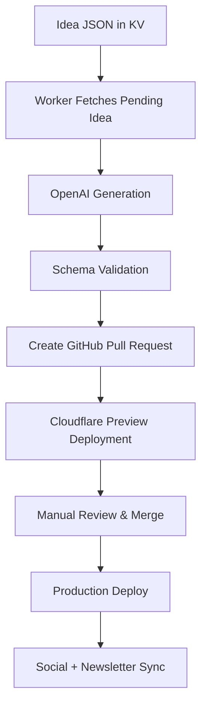

# AI Pipeline — farhan.dev

> _Controlled, auditable AI-assisted content generation for automated engineering insights._

---

## 🧭 Overview

The **AI Pipeline** powers farhan.dev’s automated nugget generation system.  
It transforms lightweight “idea seeds” into polished, production-ready MDX nuggets — reviewed and deployed with minimal manual input.

Each generation cycle follows a simple flow:

```
Idea (JSON in KV)
  ↓
AI Worker (OpenAI)
  ↓
Draft MDX
  ↓
Pull Request (GitHub)
  ↓
Review + Merge
  ↓
Cloudflare Pages Deploy
```

---

## ⚙️ System Architecture

### Components

| Component | Purpose |
|------------|----------|
| **Cloudflare Worker** | Orchestrates AI generation and PR creation |
| **Workers KV** | Stores idea seeds, generation state, and metadata |
| **OpenAI API** | Generates nugget content using a tuned system prompt |
| **GitHub REST API** | Opens and labels PRs for human review |
| **Cloudflare Pages** | Builds and deploys new nuggets on merge |
| **Giscus + Fuse.js** | Enable comments and client-side search |

---

### Mermaid Diagram



---

## 🧠 Prompt Design Philosophy

The system prompt guides AI output to reflect **expert-level engineering brevity**:

```
You are an expert technical writer specializing in backend and AI engineering.
Generate concise, high-signal engineering insights ("nuggets") for senior engineers.

Format:
1. Context (1 sentence setup)
2. Insight (3–5 bullets or short paragraphs)
3. Optional code example (≤20 LOC)
4. Apply It (1–2 actionable bullets)
Voice: Direct, confident, peer-to-peer (senior IC tone).
```

This template ensures consistent tone, brevity, and technical realism across all generated nuggets.

---

## 🔄 Generation Workflow

### 1. Idea Seeding
Ideas are stored as JSON objects in Workers KV:

```json
{
  "slug": "retry-budgets",
  "topic": "Retry budgets that won’t DDoS your own API",
  "tags": ["reliability", "api-design"]
}
```

### 2. AI Generation
The Worker pulls pending ideas, calls OpenAI with the system prompt, and receives structured MDX output.

### 3. Validation
The output is schema-validated for:
- Frontmatter completeness
- Length (150–300 words)
- Code block syntax safety
- Tag conformity

### 4. Pull Request Creation
The Worker opens a PR against `master`, attaching:
- Generated `.mdx` file under `/src/content/nuggets/`
- PR body with summary and checklist

### 5. Review & Merge
- Reviewer checks technical accuracy and tone.
- Once merged, Cloudflare Pages redeploys instantly.

### 6. Distribution Automation
Post-merge, manual or automated workflows can convert the MDX nugget into:
- LinkedIn post draft
- Newsletter snippet (for Buttondown/Substack)

---

## 🧰 Tech Stack Summary

| Layer | Technology |
|--------|-------------|
| Framework | Cloudflare Workers (TypeScript) |
| Model | OpenAI Chat Completions API (`gpt-4o-mini`) |
| Data Store | Workers KV |
| Automation | Cloudflare Workers (scheduled triggers) |
| Deployment | Cloudflare Pages |
| Validation | JSON schema validation (word count, tags, MDX structure) |

---

## 🔒 Security & Reliability

- **KV Partitioning**: Separate namespaces for dev/staging/prod.
- **Rate Limiting**: Controlled trigger frequency.
- **Auth**: Protected endpoints via Cloudflare Access or tokens.
- **Auditing**: All generations go through PR review.
- **Data Hygiene**: No PII or untrusted input passed to AI.

---

## 🧩 Future Improvements

- 🤖 Automated critic pass (style/accuracy comments)
- 🧮 Analytics dashboard (generation success rate)
- 🔁 Semantic deduplication of ideas
- 💬 AI-assisted review suggestions
- 🧠 Semantic search for nuggets

---

**Outcome:**  
A low-cost, fully auditable AI pipeline that bridges **content automation** and **engineering credibility** — running entirely on Cloudflare’s free tier.

---

> _“AI-assisted writing that feels human — built with the same rigor as backend systems.”_
