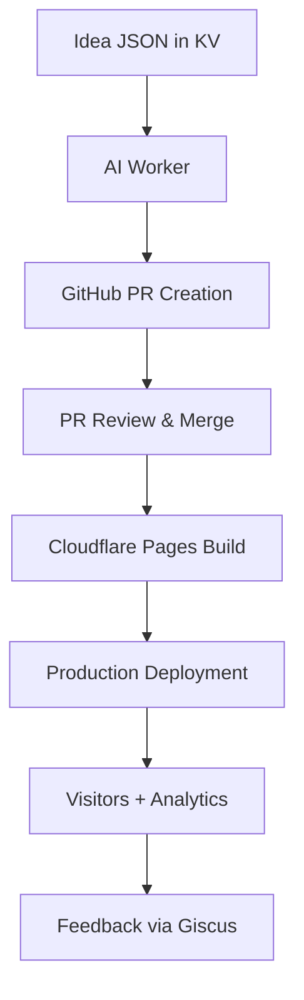

# farhan.dev Architecture Overview

> _Modern, automated publishing stack for backend and AI engineering insights._

---

## 🧭 Overview

The **farhan.dev** platform combines a static site architecture with automated AI-assisted content generation.  
It’s built for **scalability, maintainability, and zero-cost hosting** — leveraging Cloudflare’s developer stack.

---

## 🧱 High-Level Architecture

**Core Stack:**

| Layer | Technology | Purpose |
|-------|-------------|----------|
| Frontend | [Astro](https://astro.build) + MDX + Tailwind | Static generation, flexible components |
| Hosting | [Cloudflare Pages](https://pages.cloudflare.com) | Global CDN-backed deployment |
| Automation | Cloudflare Workers | Scheduled generation and PR creation |
| AI Engine | [Cloudflare Workers](https://developers.cloudflare.com/workers) + OpenAI | Nugget generation |
| Data Storage | Workers KV | Idea queue and state persistence |
| Search | Fuse.js | Fast client-side search |
| Comments | Giscus | GitHub Discussions-based comments |
| Analytics | Cloudflare Web Analytics | Lightweight, privacy-friendly tracking |

---

## 🧩 System Diagram



---

## 🧰 Repository Structure

```
/src/content/nuggets/ → Generated MDX content
/ideas/               → JSON idea seeds
/workers/ai-generator → Cloudflare Worker source (includes /scripts/)
/docs/                → System documentation
```

---

## 🪄 Build & Deployment Flow

1. **Generate ideas** → store in `/ideas/` or Workers KV.  
2. **Worker** picks an idea and generates content via OpenAI.  
3. **Worker** validates and opens a PR directly via GitHub API.  
4. **Review + Merge** → triggers automatic rebuild on Cloudflare Pages.  
5. **Site redeploys** instantly with the new nugget live.

---

## 🧱 Infrastructure Details

| Service | Description |
|----------|-------------|
| **Cloudflare Pages** | Hosts Astro static build, handles previews on PRs |
| **Cloudflare Workers** | Runs generation, validation, and PR creation logic |
| **Workers KV** | Acts as a queue for idea storage and processing state |
| **GitHub REST API** | Used by Worker to create PRs and manage branches |
| **OpenAI API** | Powers content generation with structured prompts |

---

## ⚙️ Development Setup

```bash
# Install dependencies
npm install

# Local Astro preview
npm run dev

# Test Worker locally
cd workers/ai-generator
wrangler dev
```

---

## 🚀 Design Principles

- **Automated, not autonomous** — every AI generation passes review before publish.  
- **Zero-cost infrastructure** — runs entirely on Cloudflare’s free tier.  
- **Composable and portable** — easily extended with new pipelines or components.  
- **Transparent** — open-source with public workflow definitions.

---

> _Infrastructure that writes — built for backend engineers, by one._
