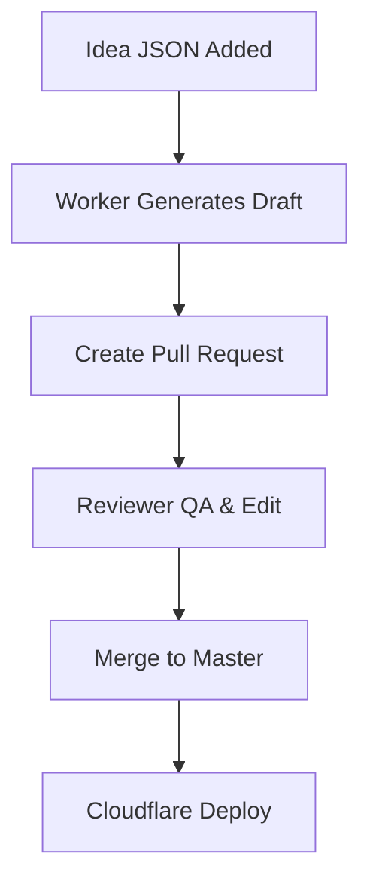

# Editorial Workflow — farhan.dev

> _Ensuring quality, tone, and consistency in AI-generated engineering content._

---

## 🧭 Overview

The **editorial workflow** ensures that every AI-generated nugget meets the same editorial standards as human-written work — short, high-signal, and technically accurate.

It balances **automation speed** with **human review** to preserve credibility.

---

## ⚙️ Workflow Summary



---

## 🧩 Roles

| Role | Responsibility |
|------|----------------|
| **Generator Bot** | Converts ideas to MDX nuggets and opens PRs |
| **Reviewer (You)** | Approves and merges final nugget (performs style & accuracy review) |

_Note: Automated critic pass is planned for future implementation._

---

## 🧱 Pull Request Template

```markdown
## Nugget Batch Summary
- [ ] Technical accuracy verified
- [ ] No invented metrics or vendor fluff
- [ ] Code ≤ 20 LOC, illustrative only
- [ ] Tone: confident, peer-to-peer

## Items in this PR
- Auto-generated nuggets: <count>
- Topics:
  - <slug-1>
  - <slug-2>

## Post-Merge
- [ ] Schedule LinkedIn post (Buffer/Typefully)
- [ ] Add to newsletter digest
```

---

## 🧠 Review Checklist

1. **Accuracy:** No incorrect technical claims.  
2. **Clarity:** Each nugget teaches a concrete insight in ≤300 words.  
3. **Tone:** Reads like a senior engineer explaining, not marketing.  
4. **Code:** Illustrative, self-contained, ≤20 LOC.  
5. **Tags:** Relevant and consistent with site taxonomy.

---

## 🧰 Branch & Protection Setup

- Default branch: `master` (protected)  
- PRs: auto-created by the Worker via `<branch-prefix>/<slug>-<timestamp>` (configurable via `GITHUB_BRANCH_PREFIX`)  
- Require at least one review before merge  
- Enable **Cloudflare preview deployments** for live review

---

## 🔄 Post-Merge Automation

After merge:
1. Cloudflare Pages auto-rebuilds production.  
2. Optional script prepares LinkedIn + newsletter versions.  
3. Giscus discussions auto-link to new nuggets.

---

## 🧩 Continuous Improvement

- Quarterly content audit for style and accuracy.  
- Update system prompt based on reviewer feedback.  
- Tag underperforming nuggets for rewrite or removal.

---

> _AI writes the drafts. You keep the voice._
