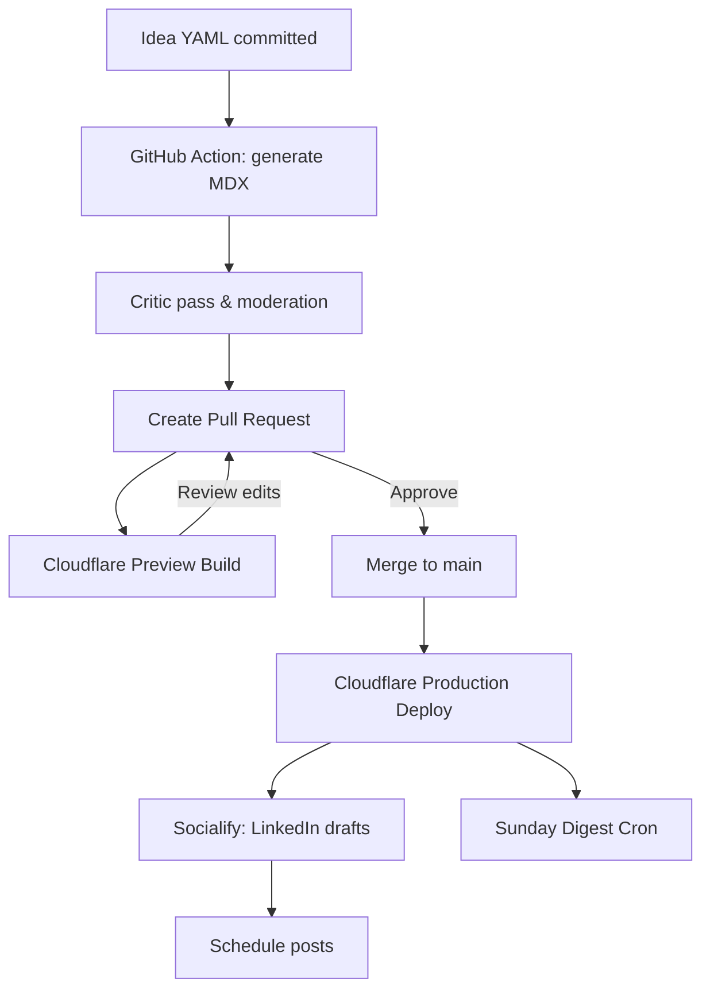

**farhan.dev Relaunch Plan — Backend & AI Engineering Nugget Platform**

---

## 1. Vision & Positioning

**Goal:** Build farhan.dev into a lightweight, automated hub of short, high-impact **backend and AI engineering** insights ("nuggets") that showcase Farhan Hasin Chowdhury’s engineering expertise and technical writing credibility while requiring minimal maintenance.

**Tagline:** "I build scalable backends and AI systems — and share how they work."

**Value Proposition:** Concise, high-signal lessons from real backend **and AI engineering** experience, generated and curated by AI, reviewed by Farhan.

---

## 2. Architecture Overview

**Stack:**
- Framework: **Astro** (MDX-first, islands architecture, great for static sites)
- Deployment: Cloudflare Pages (free)
- Functions: Cloudflare Workers (search, cron, newsletter sync)
- Content Source: MDX files auto-generated by OpenAI API via GitHub Action
- Search: Fuse.js client-side search (free, static)
- Comments: Giscus (GitHub Discussions)
- Analytics: Cloudflare Web Analytics
- Newsletter: Substack or Buttondown (free tier)

**Repository Structure:**
```
/content/nuggets/        # Generated nuggets (MDX)
/ideas/                  # YAML idea seeds
/scripts/                # Generation & QA scripts
/components/             # Custom MDX components
/public/                 # Static assets
```  

**Workflow:**
1. New idea added as `/ideas/topic.yml`.
2. GitHub Action triggers OpenAI API script.
3. Nugget generated as MDX + committed to `/content/nuggets/`.
4. Cloudflare Pages rebuilds automatically.
5. Newsletter and LinkedIn posts auto-generated from same content.

---

## 3. Content Philosophy

**Format:** 150–300 words per nugget.
- **Context:** One-sentence setup.
- **Insight:** 3–5 bullets or short paragraphs.
- **Code/Diagram:** Optional, up to 20 LOC or 1 diagram.
- **Apply It:** 1–2 actionable bullets.

**Voice:** Experienced engineer talking to peers. Direct, confident, and grounded in real work.

**Tags:** microservices, reliability, api-design, scaling, infra, **ai-engineering**, llm, rag, vector-search, evaluation, prompt-engineering, devops.

---

## 4. Site Structure

### Home
- Hero section: tagline, profile image, quick metrics (7+ years exp, 500k+ readers, MongoDB partnership).
- Featured Nuggets grid (6 recent posts).
- Call-to-action: Subscribe to newsletter.

### Nuggets Feed
- Infinite scroll of cards (title, summary, tags, read time ~1 min).
- Tag filters.
- Search bar (Fuse.js).

### Individual Nugget Page
- Readable layout.
- Giscus comments.
- "Share on LinkedIn" button.
- Related nuggets.

### About
- Short narrative bio.
- Highlight of writing collaborations and open source work.
- CTA: Hire/Collaborate.

### Work With Me
- Two paths: Hiring (backend roles) / Writing (brand collaborations).
- Portfolio of logos (MongoDB, freeCodeCamp, Adeva, Honeybadger).
- Contact form.

### Newsletter
- Subscription form (Buttondown/Substack).
- Archive of weekly digests.

---

## 5. Automation & AI Integration

### Generation Script
- Uses OpenAI Responses API.
- System prompt ensures tone consistency and technical realism.
- YAML idea seeds drive topics.
- Critic pass checks for accuracy and brevity.

### Deployment Pipeline
- GitHub Action triggers generation on commit.
- Cloudflare Pages redeploys site.
- Optional Cloudflare Cron: nightly rebuild (if desired).

### Distribution Automation
- Markdown/MDX converted to:
  - LinkedIn text post (shorter format)
  - Newsletter snippet (weekly digest)
- Cross-posted via Buffer or Zapier.

---

## 5A. Editorial Workflow (Option A — Pre-merge Review)

**Goal:** Ensure every nugget is reviewed before it goes live, without slowing down automation.

### Roles
- **Generator Bot (GH Action):** Converts `/ideas/*.yml` → `/content/nuggets/*.mdx`, opens a PR.
- **Critic Bot (optional):** Leaves a comment with accuracy/style checks.
- **Reviewer (You):** Skim + edit in GitHub UI, then merge.

### Branch Strategy
- Default branch: `main` (protected)
- Working branch per batch: `nuggets/<YYYY-MM-DD>-batch`

### PR Template (add to `.github/pull_request_template.md`)
```
## Nugget Batch Summary
- [ ] Technical accuracy
- [ ] No invented metrics/vendor claims
- [ ] Code ≤ 20 LOC and illustrative
- [ ] Tone: concise, senior IC, no fluff

## Items in this PR
- Auto-generated nuggets: <count>
- Topics:
  - <slug-1>
  - <slug-2>

## Post-merge
- [ ] Schedule LinkedIn posts (Buffer/Typefully)
- [ ] Include in Sunday digest
```

### GitHub Action — Generate & Open PR (add to `.github/workflows/nuggets.yml`)
```yaml
name: Generate Nuggets PR
on:
  workflow_dispatch:
  push:
    paths:
      - 'ideas/**.yml'
permissions:
  contents: write
  pull-requests: write
jobs:
  generate:
    runs-on: ubuntu-latest
    steps:
      - uses: actions/checkout@v4
      - uses: actions/setup-node@v4
        with: { node-version: 20 }
      - run: npm ci
      - name: Generate MDX from ideas
        env:
          OPENAI_API_KEY: ${{ secrets.OPENAI_API_KEY }}
          OPENAI_MODEL: gpt-4o-mini
        run: node scripts/generate-nuggets.js
      - name: Critic pass (optional)
        env:
          OPENAI_API_KEY: ${{ secrets.OPENAI_API_KEY }}
          OPENAI_MODEL: gpt-4o-mini
        run: node scripts/critic-nuggets.js || true
      - name: Create PR
        uses: peter-evans/create-pull-request@v6
        with:
          branch: nuggets/${{ github.run_id }}
          title: 'Nugget batch ${{ github.run_id }}'
          body: |-
            Auto-generated nugget batch. Please review checkboxes in the PR template.
          labels: nugget, needs-review
```

### Branch Protection (GitHub → Settings → Branches)
- Require PR review from code owners (add yourself under `CODEOWNERS`).
- Require status checks to pass (build succeeds, lint).
- Dismiss stale reviews on new commits.

### Preview Builds
- Enable preview deployments for PRs (Cloudflare Pages → your project → Git integration → *Preview builds on PRs*). Reviewer checks the live preview before merge.

### Merge → Publish → Cross-post
1. **Merge PR** to `main`.
2. Cloudflare Pages auto-deploys (production).
3. `socialify` script runs (optional Action) to produce LinkedIn draft text + image card.
4. Approve/schedule the LinkedIn posts in Buffer/Typefully.

### Mermaid Diagram (add to docs)


---

## 6. Content & Distribution Strategy

### Phase 1 (Month 1–2): Build Consistency
- Publish **3 nuggets/week** (Mon–Wed–Fri).
- Cross-post each nugget to LinkedIn.
- Build backlog of 12–18 nuggets.

### Phase 2 (Month 3+): Sustain & Grow
- Publish **2 nuggets/week** (Tue–Thu).
- Add a weekly recap on Sundays: *"This Week in Scalable Backends."*
- Engage on LinkedIn 3–4x/week.

### LinkedIn Post Structure
1. **Hook:** relatable one-liner ("Ever retried yourself into a DDoS?").
2. **Value:** 3–4 concise insights.
3. **Takeaway:** one lesson learned.
4. **CTA:** "Read the full 2-min nugget on farhan.dev."

### Weekly Routine
- Mon: Publish nugget + LinkedIn post.
- Wed: Publish nugget + engage comments.
- Fri: Publish nugget + weekend recap.
- Sun: Send newsletter summary.

---

## 7. Three-Month Editorial Calendar Template

> **Publishing cadence:** 3 nuggets/week (Mon–Wed–Fri) in Months 1–2, then 2/week (Tue–Thu) in Month 3+. Each week mixes **one Backend** and **one AI Engineering** nugget (plus one flex/post based on traction).

| Week | Backend Theme & Sample Nugget | AI Engineering Theme & Sample Nugget | Cross-Post Angle |
|------|-------------------------------|--------------------------------------|------------------|
| 1 | **Idempotency** — "Preventing double-billing with idempotency keys" | **Prompt Patterns** — "Chain-of-Thought vs. structured reasoning: when to avoid free-form" | "Small guards prevent big incidents." |
| 2 | **Distributed Locks** — "Redis SET NX PX to stop duplicate jobs" | **Function Calling** — "Designing safe tool-use with input/output schemas" | "Concurrency and control for humans *and* LLMs." |
| 3 | **Retries** — "Retry budgets that won’t DDoS your own API" | **Latency Budgeting** — "Keeping LLM round-trips under 1s with caching" | "Budgets beat guesses." |
| 4 | **Observability** — "Four signals that actually matter under failure" | **Eval 101** — "Golden sets for regression-proof prompts" | "Measure what matters." |
| 5 | **Caching** — "When caches lie and how to detect staleness" | **RAG Pitfalls** — "Chunking, overlap, and why retrieval beats prompt stuffing" | "Fast is worse than wrong if it’s stale." |
| 6 | **API Versioning** — "Non-breaking rollouts with explicit versions" | **Guardrails** — "Pydantic/Zod validation before model calls" | "Trust is versioned." |
| 7 | **Queues & Backpressure** — "Smoothing traffic with queue depth thresholds" | **Hallucination Control** — "Cite-or-silent patterns and refusal policies" | "Throughput without chaos." |
| 8 | **Multi-Tenancy** — "DB-per-tenant tradeoffs & operational hygiene" | **Cost Control** — "Router stacks: small models first, escalate on need" | "Scale the right layer." |
| 9 | **Incidents** — "Five whys for infrastructure, not people" | **Safety** — "PII scrubbing and secrets hygiene in prompts/logs" | "Blame the system, fix the system." |
|10 | **Infra as Code** — "Preventing drift with Terraform plans in CI" | **Vector Basics** — "Cosine similarity and ‘when pgvector is enough’" | "Reproducibility wins." |
|11 | **DB Reliability** — "Practical migration tactics under load" | **Short-Context Tricks** — "RAG-lite: task-focused snippets over whole docs" | "Evolve without downtime." |
|12 | **Developer Velocity** — "Guardrails for speed (lint, tests, preview envs)" | **Agent Skepticism** — "When a simple orchestrator beats ‘agents’" | "Move fast, don’t break pipelines." |

---

## 8. Growth & Analytics

**Metrics to Track:**
- Pageviews per nugget (Cloudflare Analytics)
- LinkedIn impressions and saves
- Newsletter signups (Buttondown/Substack)
- Search queries (Fuse.js analytics log)

**Quarterly Review:**
- Identify top 5 nuggets by engagement.
- Repurpose into: mini video explainer, carousel, or longform post.

---

## 9. Long-Term Extensions

- Add **semantic search** (Typesense + pgvector) later.
- Add **AI Q&A sidebar** ("Ask this article") powered by local embeddings.
- Launch **free micro-course** ("15 Backend Patterns in 15 Days").
- Introduce guest nuggets from peers or open-source collaborators.

---

**Outcome:** A self-sustaining, automated, high-signal platform that demonstrates Farhan’s backend expertise, grows audience reach, and attracts both employers and writing partners.

