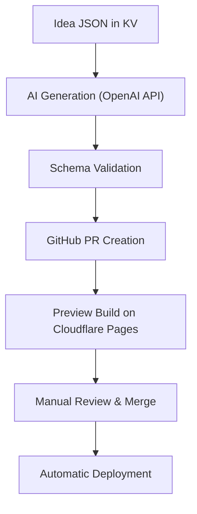

# AI Generator Worker — farhan.dev

> Cloudflare Worker that powers automated, AI-assisted content generation for [farhan.dev](https://farhan.dev).

---

### 🧭 Overview

This Worker creates, validates, and submits new **engineering nuggets** automatically.  
It listens for new idea seeds in KV, generates MDX drafts using OpenAI, and opens a **pull request** back to GitHub — where each nugget goes through a lightweight review before publication.

---

### 🧱 Architecture

**Flow:**



**Stack:**
- Cloudflare Workers (TypeScript)
- Workers KV (state + seed storage)
- OpenAI Chat Completions API
- GitHub REST API (via token)
- Wrangler for local testing & deployment

---

### 🧩 Responsibilities

- Fetch pending idea seeds from KV.  
- Generate nugget drafts via OpenAI (using curated system prompt).  
- Validate structure & tone (150–300 words, proper tags, MDX-safe).  
- Create a PR to `/src/content/nuggets/` in `fhsinchy/farhan-dot-dev`.  
- Track PR status and update idea queue accordingly.

---

### 🔐 Environment Bindings

| Variable | Description |
|-----------|-------------|
| `OPENAI_API_KEY` | API key for model access (set via `wrangler secret`) |
| `GITHUB_TOKEN` | Scoped token for PR creation (set via `wrangler secret`) |
| `NUGGET_STORE` | KV namespace for tracking generated nuggets |
| `IDEA_QUEUE` | KV namespace for pending idea seeds |
| `GITHUB_REPO` | Repository in format `owner/repo` |
| `GITHUB_BRANCH_PREFIX` | Prefix for PR branch names (e.g., `nuggets`) |

Configured in `wrangler.toml`:

```toml
[vars]
GITHUB_REPO = "fhsinchy/farhan-dot-dev"
GITHUB_BRANCH_PREFIX = "nuggets"

[[kv_namespaces]]
binding = "NUGGET_STORE"
id = "<your-nugget-store-kv-id>"

[[kv_namespaces]]
binding = "IDEA_QUEUE"
id = "<your-idea-queue-kv-id>"
```

Secrets (set via `wrangler secret put`):
- `OPENAI_API_KEY`
- `GITHUB_TOKEN`

---

### 🧠 Prompting Strategy

The Worker uses a custom system prompt tuned for:
- **Voice:** Senior IC talking to peers.
- **Format:** Context → Insight → (Optional Code) → Apply It.
- **Length:** 150–300 words.
- **Style:** Concise, confident, technical realism — no fluff or marketing.

See [`src/openai.ts`](./src/openai.ts) for the system prompt implementation (hardcoded as `SYSTEM_PROMPT` constant).

---

### 🧰 Local Development

**Initial Setup:**
1. Copy the example configuration:
   ```bash
   cp wrangler.toml.example wrangler.toml
   ```
2. Create KV namespaces:
   ```bash
   wrangler kv:namespace create "NUGGET_STORE"
   wrangler kv:namespace create "IDEA_QUEUE"
   ```
3. Update `wrangler.toml` with the actual namespace IDs (from the output above).
4. Set secrets:
   ```bash
   wrangler secret put OPENAI_API_KEY
   wrangler secret put GITHUB_TOKEN
   ```

**Run locally:**
```bash
npm install
wrangler dev
```

**Note:** Copy `wrangler.toml.example` to `wrangler.toml` and update it with your actual KV namespace IDs. The example file is committed to version control, but `wrangler.toml` is gitignored to keep your local configuration private.

Generate a sample idea:

```bash
curl -X POST https://<worker-url>/generate   -H "Authorization: Bearer $TOKEN"   -d '{"topic": "Distributed locking in Redis"}'
```

Then check your GitHub repo for the opened PR.

---

### 🔒 Security

- Auth handled via Cloudflare Access or Bearer tokens.
- Rate-limited to prevent abuse.
- KV keyspace partitioned for separate environments (dev/prod).
- No direct public API exposure — only internal triggers or cron.

---

### 🧭 Roadmap

- ✅ End-to-end generation → PR flow
- 🚧 Critic pass auto-comment on PRs
- 🪶 Semantic idea deduplication
- 📈 Analytics: generation success rate & topic coverage

---

> _Designed for automation, written for credibility._
